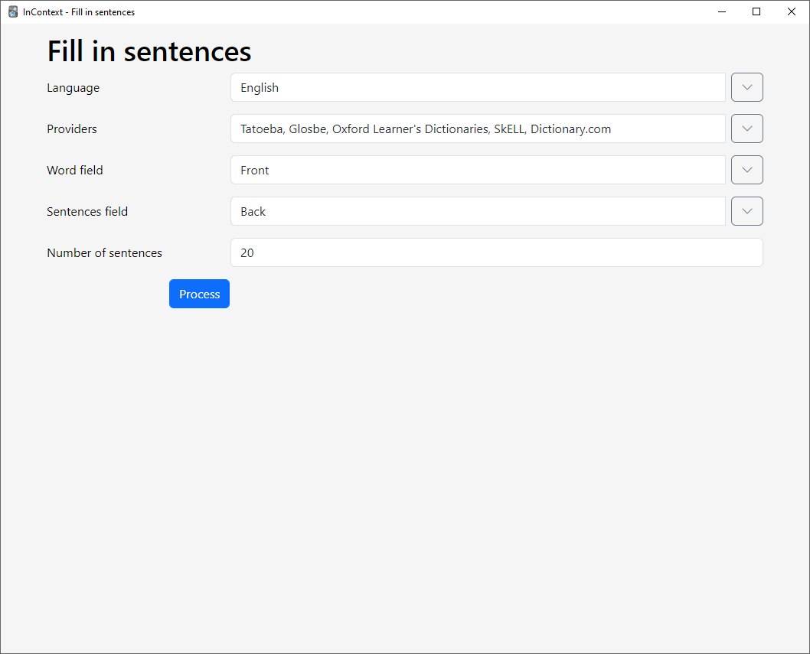

# InContext

An [Anki](https://apps.ankiweb.net/) add-on that fetches and displays random example sentences in different languages from various sources.

## Template filter

The add-on mainly works as a template filter to show random example sentences for vocabulary each time a card is viewed.

You just have to put a filter like this in your [card template](https://docs.ankiweb.net/templates/intro.html):

```
{{incontext:Front}}
```

Here, the add-on will show a random English example sentence containing the word in the `Front` field.

You can specify the language using the `lang` option:

```
{{incontext lang=en:Front}}
```

Currently supported values are:

-   `en` English
-   `tr` Turkish
-   `ja` Japanese
-   `ko`: Korean
-   `zh`: Chinese

The default is `en`.

Sentences are fetched from multiple sources such as https://www.lexico.com/ (for English) and https://sozluk.gov.tr (for Turkish).
You can show sentences from only a certain source by using the `provider` option, like this:

```
{{incontext lang=en provider=lexico:Front}}
```

For a list of supported sources, see the [providers](./src/providers/) folder.
The identifier of each provider is defined by a `name` variable inside each provider class.
A list of available providers is also shown in the [interface](#interface).

More sites and languages will be added in the future. Contributions are welcome!

## Fill-in option

You can also add sentences to a chosen field in multiple notes using the browser's _Notes > InContext: Add sentences_ menu item. This is useful if you review on mobile.



## Importing Tatoeba databases

To make [Tatoeba](https://tatoeba.org) databases available for use with the add-on, please see [this doc](./src/user_files/tatoeba/README.txt).

## Interface

The add-on has an experimental graphical interface to manage sentences that can be accessed from **Tools > InContext**.


## Demo

Download this deck for a demo of the add-on: https://drive.google.com/file/d/1Era5ksSa59xjB3ZbVQsdoTbQEigzh6Bi/view?usp=sharing

## Download

You can download the add-on from its page on AnkiWeb: https://ankiweb.net/shared/info/385420176

## Storage

In the first review of a card that has the InContext filter, sentences will be fetched from the language providers and saved in the `user_files/sentences.db` file. Subsequent reviews will use those saved sentences (if any) and avoid making more requests to the providers. You can anyway update saved sentences manually from the GUI.

## Known Issues

-   **IMPORTANT**: In versions before 0.3.1, the add-on suffered from an [issue](https://github.com/ankitects/anki/pull/2518) preventing updates from being properly installed, which resulted in Anki prompting to update the add-on every time. To fix this, please follow the steps carefully:
    1. Download version 0.3.1 from [this page](https://github.com/abdnh/anki-incontext/releases/tag/0.3.1). You should download the `incontext_ankiweb.ankiaddon` file or this won't work.
    2. Close Anki then double click on the .ankiaddon file to install it and run Anki. Closing Anki is important for the update to work.
    3. Go to _Tools > Add-ons_ and click _Check for Updates_. You should be prompted to update the add-on. The issue should be fixed after updating this time.

## Changelog

See [CHANGELOG.md](CHANGELOG.md) for a list of changes.

## Credit

Some icons are adapted from [Bootstrap Icons](https://icons.getbootstrap.com/); licensed under the MIT.

## Support & feature requests

Please post any questions, bug reports, or feature requests in the [support page](https://forums.ankiweb.net/t/incontext-learn-vocabulary-in-context-with-random-sentences/24017) or the [issue tracker](https://github.com/abdnh/anki-incontext/issues).

If you want priority support for your feature/help request, I'm available for hire.
You can get in touch from the aforementioned pages, via [email](mailto:abdo@abdnh.net) or on [Fiverr](https://www.fiverr.com/abd_nh).

## Support me

Consider supporting me if you like my work:

<a href="https://github.com/sponsors/abdnh"></a>
<a href="https://www.patreon.com/abdnh"></a>
<a href="https://www.buymeacoffee.com/abdnh" target="_blank"></a>

I'm also available for freelance add-on development on Fiverr:

<a href="https://www.fiverr.com/abd_nh/develop-an-anki-addon"></a>
