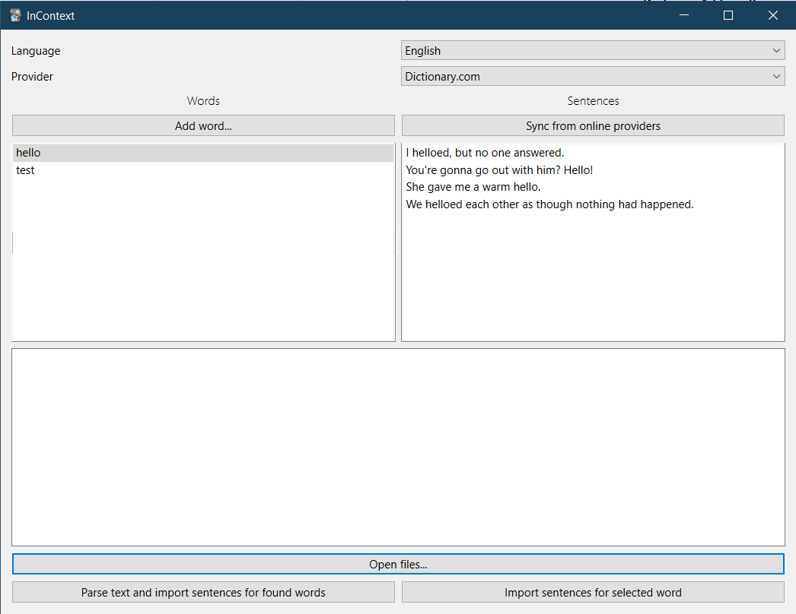

# InContext

An [Anki](https://apps.ankiweb.net/) add-on that mainly works as a template filter to show random example sentences for vocabulary each time a card is viewed.

You just have to put a filter like this in your [card template](https://docs.ankiweb.net/templates/intro.html):

```
{{incontext:Front}}
```

Here, the add-on will show a random English example sentence containing the word in the `Front` field.

You can specify the language using the `lang` option:

```
{{incontext lang=en:Front}}
```

Currently supported values are:

-   `en` English
-   `tr` Turkish
-   `ja` Japanese
-   `ko`: Korean
-   `zh`: Chinese

The default is `en`.

Sentences are fetched from multiple sources such as https://www.lexico.com/ (for English) and https://sozluk.gov.tr (for Turkish).
You can show sentences from only a certain source by using the `provider` option, like this:

```
{{incontext lang=en provider=lexico:Front}}
```

For a list of supported sources, see the [providers](./src/providers/) folder.
The identifier of each provider is defined by a `name` variable inside each provider class.
A list of available providers is also shown in the [interface](#interface).

More sites and languages will be added in the future. Contributions are welcome!

## Importing Tatoeba databases

To make [Tatoeba](https://tatoeba.org) databases available for use with the add-on, please see [this doc](./src/user_files/tatoeba/README.txt).

## Interface

The add-on has an experimental graphical interface to manage sentences that can be accessed from **Tools > InContext**.



## Demo

Download this deck for a demo of the add-on: https://drive.google.com/file/d/1Era5ksSa59xjB3ZbVQsdoTbQEigzh6Bi/view?usp=sharing

## Download

You can download the add-on from its page on AnkiWeb: https://ankiweb.net/shared/info/385420176

## Storage

In the first review of a card that has the InContext filter, sentences will be fetched from the language providers and saved in the `user_files/sentences.db` file. Subsequent reviews will use those saved sentences (if any) and avoid making more requests to the providers. You can anyway update saved sentences manually from the GUI.

## Changelog

See [CHANGELOG.md](CHANGELOG.md) for a list of changes.

## Support & feature requests

Please post any questions, bug reports, or feature requests in the [support page](https://forums.ankiweb.net/t/incontext-learn-vocabulary-in-context-with-random-sentences/24017) or the [issue tracker](https://github.com/abdnh/anki-incontext/issues).

If you want priority support for your feature/help request, I'm available for hire.
You can get in touch from the aforementioned pages, via [email](mailto:abdo@abdnh.net) or on [Fiverr](https://www.fiverr.com/abd_nh).

## Support me

Consider supporting me if you like my work:

<a href="https://github.com/sponsors/abdnh"></a>
<a href="https://www.patreon.com/abdnh"></a>
<a href='https://ko-fi.com/abdnh'></a>

I'm also available for freelance add-on development on Fiverr:

<a href="https://www.fiverr.com/abd_nh/develop-an-anki-addon"></a>
