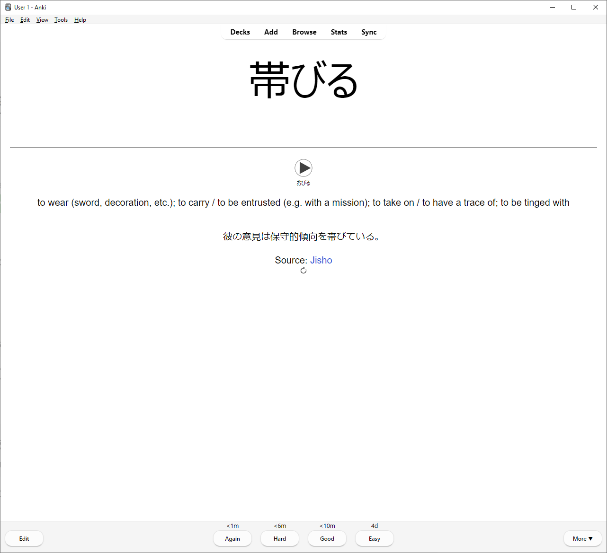

# Displaying random sentences while reviewing

The add-on also supports displaying random example sentences for vocabulary each time a card is viewed.

You just have to put a filter like this in your [card template](https://docs.ankiweb.net/templates/intro.html):

```
{{incontext:Front}}
```

Here, the add-on will show a random English example sentence containing the word in the `Front` field.

You can specify the language using the `lang` option:

```
{{incontext lang=eng:Front}}
```

This fetches sentences from all supported providers for the specified language.
You can show sentences from only a certain provider using the `provider` option:

```
{{incontext lang=eng provider=dictionary.com:Front}}
```

Go to _Tools > InContext > Help_ for a complete list of supported languages and providers with their template filter codes.

If a provider is given but no language, the first supported language of the provider will be assumed.
If both language and provider are not given, the default is English with all providers.

Sentences display like this and you have the option to refresh the sentence by clicking on the cycle icon:


