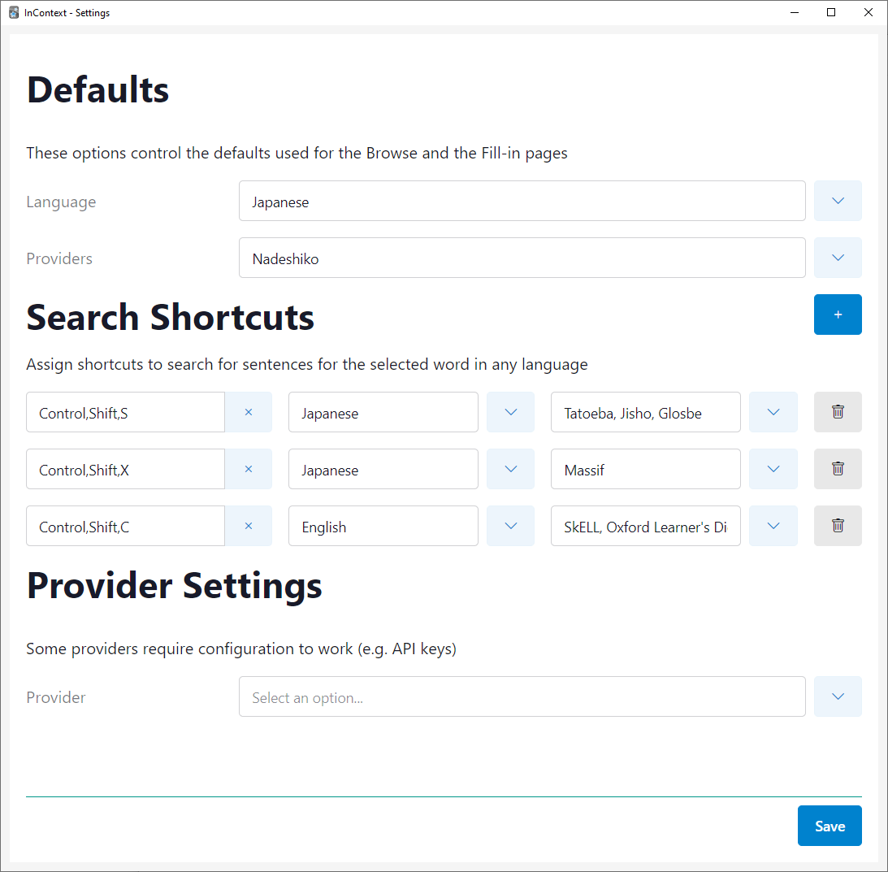

# Settings

You can access the settings screen under _Tools > InContext > Settings_.

You can customize options such as the default language/providers, assign shortcuts for looking up sentences in the [Browse screen](./browse.md), and configure provider-specific settings (if any).
